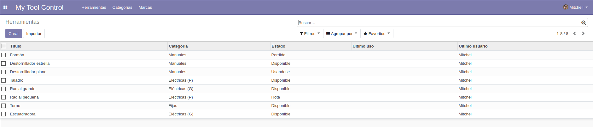
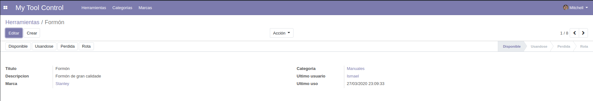
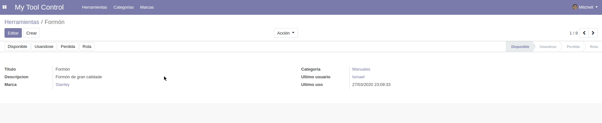
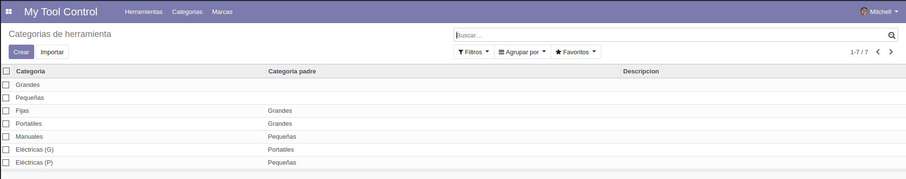
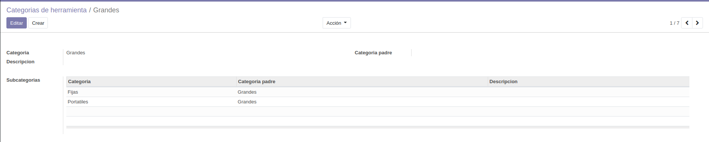
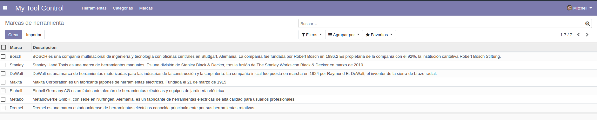
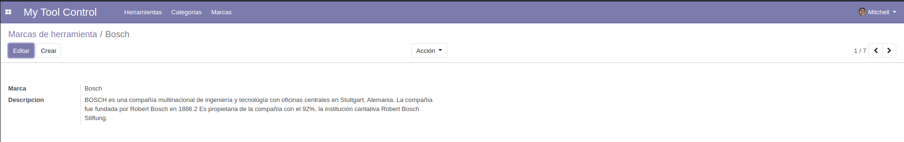

# My Tool Control
 Módulo de odoo para control de ferramentas.
 Este módulo está feito en base a unha idea que me dou meu pai polos problemas que ten el e os seus compañeiros no taller do traballo para encontrar quen usou, esta usando, perdio ou rompio unha ferramenta.

 *****

 Si xa tes [git](https://git-scm.com/book/en/v2/Getting-Started-Installing-Git) instalado, clona o repositorio con:

 ```
git clone https://github.com/IPardelo/sxe.git
 ```

 A aplicación é sinxela e consta de 3 apartados no menú:
 * [Ferramentas](https://osmeusproxectos.es/tool.csv) 
 * [Categorias](https://osmeusproxectos.es/tool.category.csv) 
 * [Marcas](https://osmeusproxectos.es/tbrandool.brand.csv)

> Clica no apartado no que queiras descargar un csv con datos de exemplo para non introducilos a man.

*****

## **Ferramentas**

**Vista de ferramentas creadas**


Neste apartado podemos crear e visualizar as ferramentas que temos rexistradas. Podemos ver a que categoría pertence cada unha, o estado no que está (**Dispoñible, Usándose, Perdida ou Rota**) e o último usuario e horario ao que fui usado.

**Vista dunha ferramenta**


Unha vez dentro da ferramenta podemos ver a marca da mesma ou editar o estado. O estado ten restriccións lóxicas, como por exemplo unha ferramenta en estado "**roto**" non pode volver a estar "**Disponible**".

Aqui podemos ver como ao cambiar o estado, cambia o "**Último uso**" e o "**Último usuario**".


*****

## **Categorias**

**Vista de categorias creadas**


Neste apartado podemos crear e visualizar as categorias que temos rexistradas.

Podemos ver o nome, a descripción e a categoría pai a que pertence cada unha (si a ten).

**Vista dunha categoría**


*****

## **Marcas**

**Vista de categorias creadas**


Neste apartado podemos crear e visualizar as marcas que temos rexistradas.

As marcas son o apartado máis sinxelo, xa que só teñen como propiedade o nome e a descripción.

**Vista dunha categoría**


*****

Módulo e documentacion feitos por [**Ismael Castiñeira Paz**](https://osmeusproxectos.es)