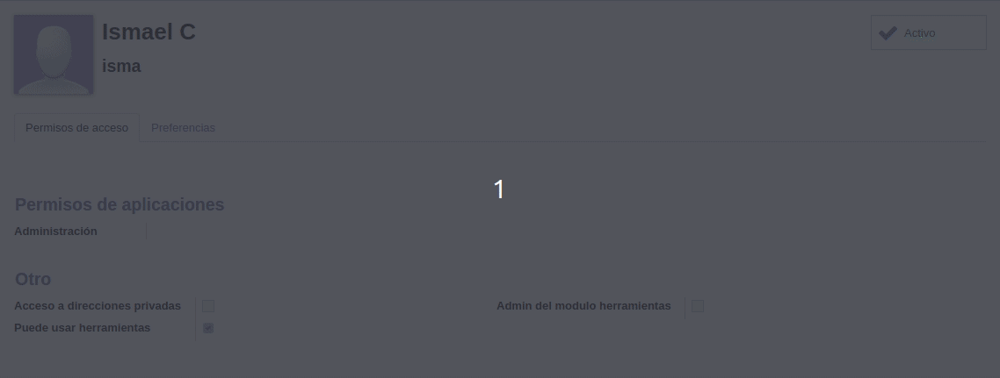

# My Tool Control

 Si xa tes [git](https://git-scm.com/book/en/v2/Getting-Started-Installing-Git) instalado, clona o repositorio con:

 ```
git clone https://github.com/IPardelo/sxe.git
 ```

 *****

 Módulo de odoo (version 12) para control de ferramentas.  
 Este módulo está feito en base a unha idea que me dou meu pai polos problemas que ten el e os seus compañeiros no taller do traballo para encontrar quen usou, esta usando, perdeu ou rompeu unha ferramenta.

 *****

## Indice:
 * Ferramentas
 * Categorias
 * Marcas
 * Habilitar usuarios

> Na carpeta "**recursos**" hai dispoñibles tres csv con datos de exemplo para non facelos a man.

*****

## **Ferramentas**

*Vista de ferramentas creadas*


Neste apartado podemos crear e visualizar as ferramentas que temos rexistradas. Podemos ver a que categoría pertence cada unha, o estado no que está (**Dispoñible, Usándose, Perdida ou Rota**) e o último usuario e horario ao que fui usado.

*Vista dunha ferramenta*


Unha vez dentro da ferramenta podemos ver a marca da mesma ou editar o estado. O estado ten restriccións lóxicas, como por exemplo unha ferramenta en estado "**roto**" non pode volver a estar "**Disponible**".

Aqui podemos ver como ao cambiar o estado, cambia o "**Último uso**" e o "**Último usuario**".


*****

## **Categorias**

*Vista de categorias creadas*


Neste apartado podemos crear e visualizar as categorias que temos rexistradas. 
Podemos ver o nome, a descripción e a categoría pai a que pertence cada unha (si a ten).

*Vista dunha categoría*


*****

## **Marcas**

*Vista de marcas creadas*


Neste apartado podemos crear e visualizar as marcas que temos rexistradas.  As marcas son o apartado máis sinxelo, xa que só teñen como propiedade o nome e a descripción.

*Vista dunha marca*


*****

## **Habilitar usuarios**

*Lista de usuarios de proba*


Como habilito un usuario para que poida usar o modulo?  
Podemos ver na imaxe anterior unha casilla na esquina inferior dereita que pon "**Puede usar herramientas**" que debe estar marcada. Unha vez marcada o usuario pode usar o modulo libremente.


*****

Módulo e documentacion feitos por [**Ismael Castiñeira Paz**](https://osmeusproxectos.es)