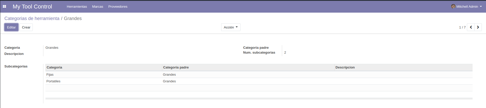

# My Tool Control

 Si xa tes [git](https://git-scm.com/book/en/v2/Getting-Started-Installing-Git) instalado, clona o repositorio con:

 ```
git clone https://github.com/IPardelo/sxe.git
 ```

 *****

 Módulo de odoo (version 12) para control de ferramentas.  
 Este módulo está feito en base a unha idea que me dou meu pai polos problemas que ten el e os seus compañeiros no taller do traballo para encontrar quen usou, esta usando, perdeu ou rompeu unha ferramenta.

 *****

## Indice:
 * Menu
 * Ferramentas
 * Categorias
 * Marcas
 * Proveedores
 * Habilitar usuarios

> Na carpeta "**recursos**" hai dispoñibles tres csv con datos de exemplo para non facelos a man.

*****

## **Menu**


*****

## **Ferramentas**

*Vista de ferramentas de proba*


Nesta vista podemos crear e visualizar as ferramentas que temos rexistradas.  

Podemos ver a que categoría pertence cada unha, o estado no que está (**Dispoñible, Usándose, Perdida ou Rota**) e o último usuario e horario ao que fui usado.

*Vista dunha ferramenta*


Unha vez dentro da ferramenta podemos ver a marca da mesma ou editar o estado cos botóns da cabeceira. O estado ten restriccións lóxicas, como por exemplo unha ferramenta en estado "**roto**" non pode volver a estar "**Disponible**".

Podemos ver como ao cambiar o estado, cambia o "**Último uso**" e o "**Último usuario**".

*****

## **Categorias**

*Vista de categorias de proba*


Nesta vista podemos crear e visualizar as categorias que temos rexistradas. 
Podemos ver o nome, a descripción e a categoría pai a que pertence cada unha (si a ten).

*Vista dunha categoría*


*****

## **Marcas**

*Vista de marcas de proba*


Nesta vista podemos crear e visualizar as marcas que temos rexistradas. Na vista principal ó abrir o menu de **marcas** vemos unha vista "*kanban*" das mesmas que nos mostra o proveedor, o nome e unha foto para identificala máis rápido.

Para editar ou ver unha entrada só debemos facer "*click*" na mesma.

*Vista dunha marca*


*****

## **Proveedores**

*Lista de proveedores de proba*


Nesta vista "*kanban*" podemos crear e visualizar os proveedores que temos rexistrados.  Podemos ver todos os seus datos excepto a descripcion.  

Para ver a descripcion debemos facer click no nome do proveedor e abrirasenos unha vista de "*formulario*" como a seguinte:

*Vista dun proveedor*


*****

## **Habilitar usuarios**

>**Como habilito un usuario para que poida usar o modulo?** 

Podemos ver na parte inferior da imaxe dous recadros de verificación:
 * **Puede usar herramientas**: é o permiso básico para que un usuario poida usar as ferramentas. Só pode cambiar o estado das mesmas.
 * **Admin del modulo herramientas**: é o permiso de control total. Pode crear, editar e eliminar ferramentas, categorias, marcas e proveedores.

*Lista de usuarios de proba*


 >**Na foto anterior que pode facer cada usuario?** 

Podemos ver que os usuarios "**Isma C**" e "**Lola B**"" tan só poden facer uso das ferramentas e "**Mitchell**" está habilitado como administrador do módulo.

*****

Módulo e documentacion feitos por [**Ismael Castiñeira Paz**](https://osmeusproxectos.es)